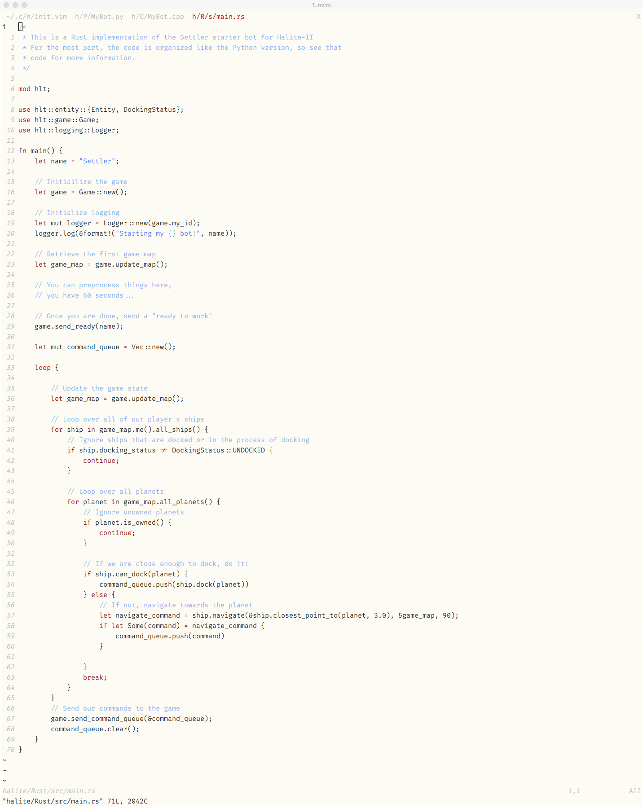

# Tuftish

A simple color scheme meant to make vim or neovim look like it came from a 
Tufte book.

Based on the [RNB](https://gist.github.com/romainl/5cd2f4ec222805f49eca) vim color scheme generator,
and inspired by the [Tufte-Jekyll](https://github.com/clayh53/tufte-jekyll) theme.

Requires a vim setup with true color (shown below in iTerm2).

